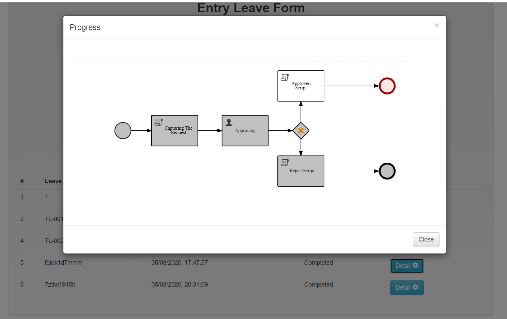
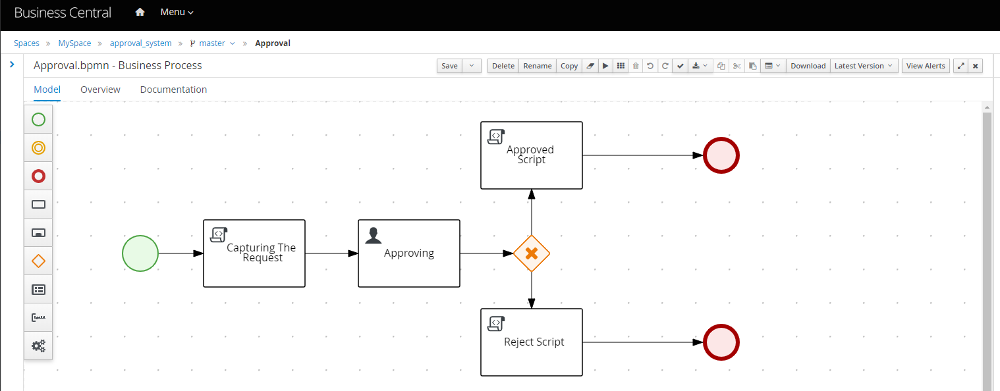

Red Hat Process Automation Manager Front End Example 02 with Approval System
=======================

A simple approval system frontend for displaying how integration between frontend and RHPAM works. 

## Tools
- Golang

## screenshot

#### Login UI


----

#### Entry Data


----

#### Progress


----

#### Approval

----


----

#### RHPAM Workflow

----

## Backend
```
https://github.com/edwin/rhpam-simple-approval-concept
```
